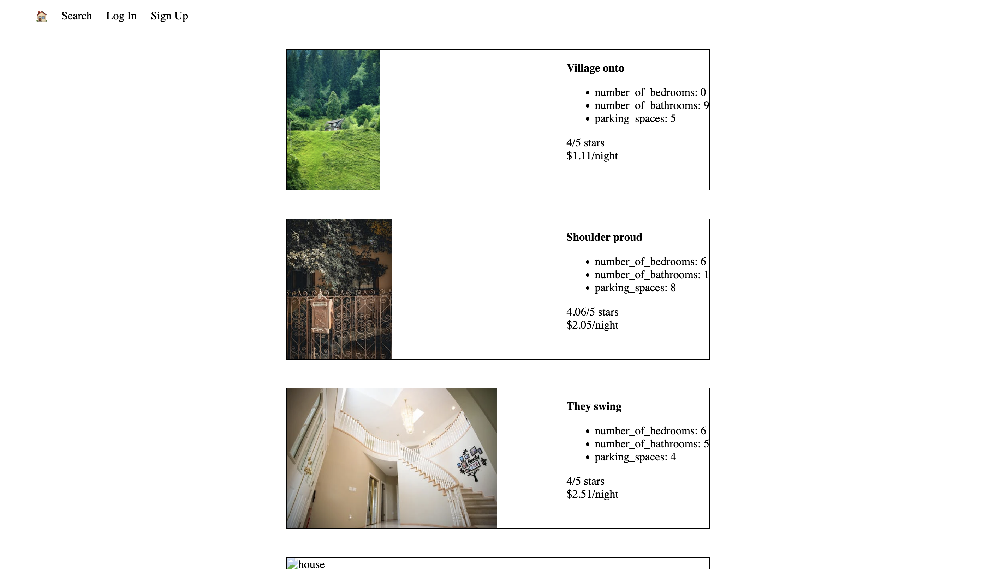
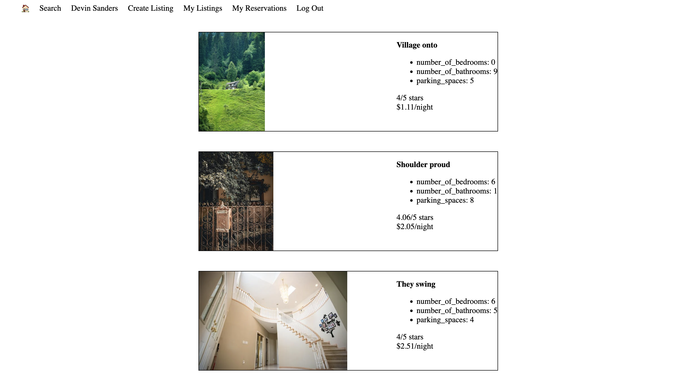
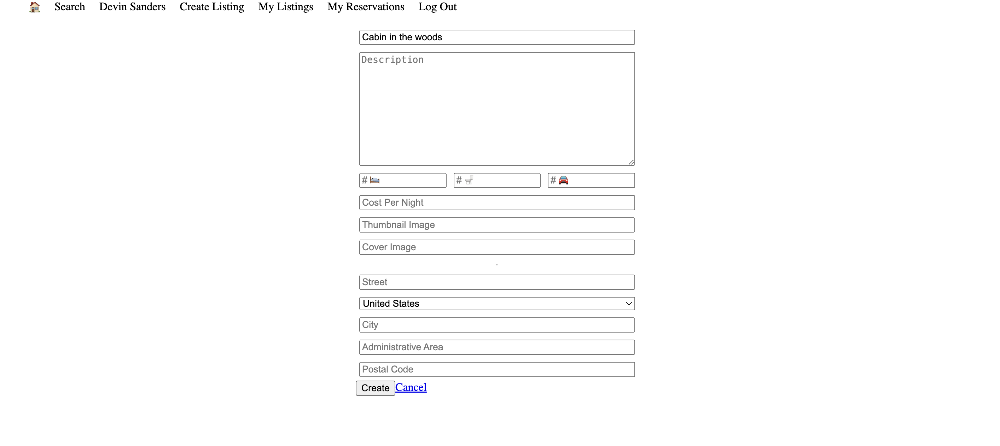

# LightBnB

LightBnB a web application that is base on the popular app AirBnB. An app for listing and booking rental properties. It allows user to browse properties base on their preference, make reservations and put up their own listings. 

## Final Product/Screenshots

- **Main Page**

- **User Main Page**

- **Create Listings**

- **Filter Search**


## Getting Started

- To start this project locally, follow these steps:
- Install dependencies using `npm install`
- Start PostgreSQL by using: `sudo service postgresql start`
- Log in to database using: `psql -U development -d lightbnb`
  - Pass: `development`
- Run the app using: `npm run local` and view it at `localhost:3000` in your browser
- Suggested user account:

```
    Name: John Stevens
    Email: charliebattle@yahoo.com
    Password: password
```

## Features

- User authentication and session management.
- Browse available properties with filters (city, price, rating, etc.).
- Book reservations for properties.
- List and manage properties for rent.
- Database interactions using PostgreSQL with parameterized queries.

## Technologies

- **Backend**: Node.js, Express.js
- **Frontend**: EJS, HTML, CSS
- **Database**: PostgreSQL
- **Testing**: Mocha&Chai